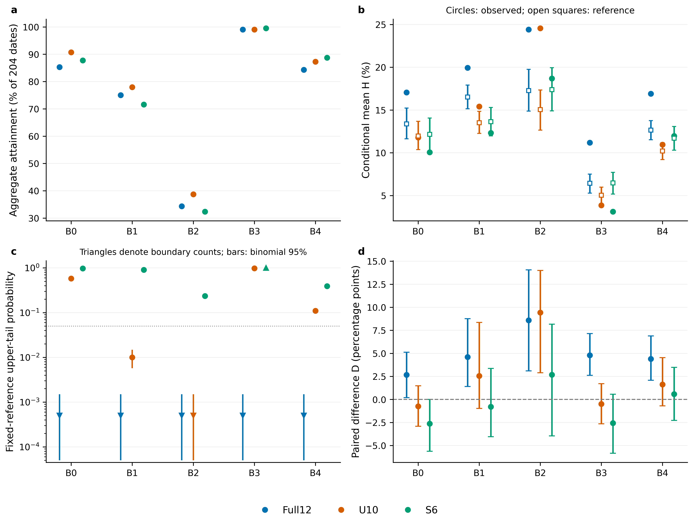
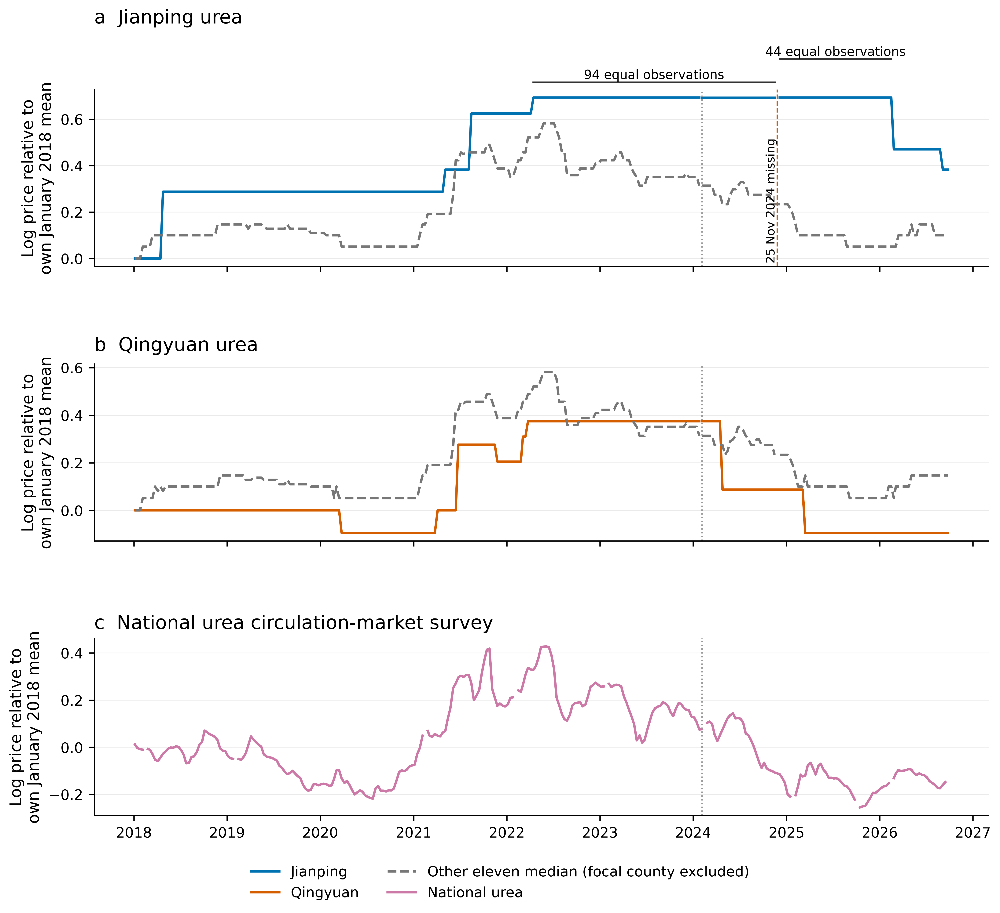

# 辽宁农业价格监测项目

**论文配套的数据与代码复现项目 · AgriPrice Monitor**

本仓库包含分析程序、论文、补充资料、项目简报、独立图件与使用文档。完整 Release 附件同时提供全部报价输入、原始网页响应、重抽样记录和参照结果，可用于离线复现研究。

[English](README.md) · [下载完整项目](https://github.com/ByronLi0207/liaoning-price-monitoring/releases/latest/download/agri-price-monitor.zip) · [快速开始](docs/quickstart.md) · [图表复现映射](docs/replication_map.md)

**存档系列 DOI：**[10.5281/zenodo.23131960](https://doi.org/10.5281/zenodo.23131960)。

## 研究内容

论文比较五个历史基准、三组县域样本，检查报价更新历史，并按同一观测日历重建预警信号。县域报价覆盖2018年1月5日至2026年9月25日，共315个监测日期、9,450条玉米与尿素记录；主要比较固定十二县，外部参照包含309期全国价格，原始档案包含610份网页响应。

结果表明，十二县总体达标率随基准选择从34.31%变为99.02%；组合规则标记十二县中的六县；通过筛查的六县总体预警覆盖0—131个监测日期。基准、县域成员、报价更新历史与预警阈值共同决定历史监测分类。

## 源码与完整附件

| 内容 | 源码仓库 | 完整Release ZIP |
| --- | --- | --- |
| 项目入口与分析程序 | 包含 | 包含 |
| reports内论文、补充资料与简报 | 包含 | 包含 |
| 独立图件与使用文档 | 包含 | 包含 |
| inputs完整报价、源档案和参照输入 | 位于Release附件 | 包含 |
| results完整结果与重抽样记录 | 位于Release附件 | 包含 |

**完整数据与参照结果请使用 Release 附件 `agri-price-monitor.zip`。** GitHub自动生成的源码ZIP对应仓库跟踪文件。完整附件包含论文、补充 S10 与 S11、全部报价输入和参照结果。系列 DOI 标识整个存档；具体存档版本提供对应的文件清单与校验值。

## 快速运行

参照计算环境为 Python 3.12.14、Node.js 24.19.0 和固定 Python 依赖。环境版本作为运行信息记录，不作为科学结果相等的判定条件。解压完整附件，进入agri-price-monitor目录后运行：

```bash
python scripts/project.py info
python scripts/project.py verify
python -m pip install -r environment/requirements.lock.txt
python scripts/project.py reproduce
```

选择克隆源码时，先下载完整附件，再准备数据：

```bash
git clone https://github.com/ByronLi0207/liaoning-price-monitoring.git agri-price-monitor
cd agri-price-monitor
python scripts/project.py prepare --archive /path/to/agri-price-monitor.zip
python scripts/project.py verify
```

prepare校验附件，补齐缺少文件，并保留现有跟踪内容。PDF导出另需LibreOffice与文档说明中的字体，使用 `python scripts/project.py export`。

## 图表与材料入口

[图表复现映射](docs/replication_map.md)逐项说明Table 1–4、Figure 1–2的输入、负责命令与结果文件，并区分计算输出、档案证据核对和文档排版。

[](figures/Figure_1.png)

[](figures/Figure_2.png)

[数据说明](docs/data.md)、[技术方法](docs/technical.md)、[结果解读](docs/results.md)和[项目结构](docs/architecture.md)提供细节。[reports目录](reports/README.md)集中保存论文、补充资料和项目简报。

## 引用与使用

CITATION.cff用于引用复现软件包，维护者以已核实的仓库账号登记，主 DOI 采用存档系列标识 **10.5281/zenodo.23131960**；论文署名按配套稿件填写。

项目代码采用MIT；项目自有的数据整理和文档采用CC BY 4.0，具体目录范围见许可文件。原始网页和第三方材料继续适用其原有权利。PCG参考实现保留environment目录中的Apache-2.0署名与许可。

新增基准与报价诊断见[补充 S10](reports/supplement_methods.pdf)：2018—2020 年月份因素解释对数交换比总变异的 4.97%，控制县与年份后解释剩余变异的 10.48%。建平六次尿素变价的全国转折匹配、完整月份和幅度阈值检查均已记录，并纳入统一复现入口。

## 环境版本与结果判定

季节性结果中仅 `provenance.python` 和 `provenance.numpy` 按完整字段路径作为运行信息处理，比较记录会保存两边版本。Node 和平台版本记录在运行回执中，也不要求版本号相等。输入与方法校验值、样本数、日期分类和计算参数仍按原规则核验；连续数值采用已有数值容差。

## 补充检验

[补充S11](reports/supplement_validation.pdf)给出60组对称删县、早期筛查与后期验证、同品种其他十一县对照。删县比较53组区间严格为正、7组包含零；历史标记五县在两段后期的玉米和尿素更新率均低于另外七县；20条长期同源恒值段内均有其他县更新。全部检验纳入统一复现入口，机器精度结果在results/supplementary_validation。
